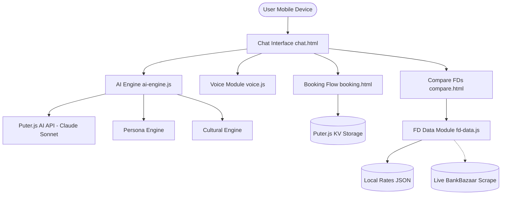

# Bharat Ka Apna FD Advisor

*Your Vernacular Financial Friend.*

🌍 **A project for the Blostem Hackathon**

## 🎯 The Problem

> "A user in Gorakhpur sees 'Suryoday Small Finance Bank — 8.50% p.a. — 12M tenor' and has no idea what to do."

For 300M+ Indians, formal finance is intimidating. Jargon like "tenor," "p.a.," and "Small Finance Bank" creates a wall of mistrust. When people don't understand terms, they default to informal methods or underperforming savings accounts, missing out on guaranteed wealth creation.

## 💡 The Solution

**Bharat Ka Apna FD Advisor** is a mobile-first, multilingual AI assistant that translates complex banking jargon into relatable, everyday analogies based on the user's persona (e.g., Farmer, Shopkeeper, Student). 

It specifically addresses the Gorakhpur use case by offering **Bhojpuri** (along with 11 other Indian languages) as a first-class citizen, ensuring the user gets guidance in the language they actually speak at home.

### Core Pillars
1. **Multilingual Chat**: Full support for Hindi, Bhojpuri, Bengali, Tamil, Telugu, Marathi, and more.
2. **Jargon Simplification**: Translates "8.50% p.a." into "Jaise ganna mein khad daalale se mitthaa ganna milela" (for a farmer) or "Netflix Premium" alternatives (for a student).
3. **End-to-End Booking**: A guided 5-step conversational flow that transitions smoothly from exploration to a tangible FD booking receipt.

## 🏗️ Architecture



## ✨ Key Features
- **Dynamic Persona Mapping**: Advice tailored to Kisan (Farmer), Dukandaar (Shopkeeper), Shikshak (Teacher), Vidyarthi (Student), and Seniors.
- **Cultural Intelligence**: "Festival Alerts" automatically detect if a 12-month FD matures near Chhath Puja or Diwali, encouraging goal-based saving.
- **Micro-interactions**: WhatsApp-style streaming responses, in-chat interactive FD calculators, and native-feeling voice input/output.
- **Offline-Ready PWA**: Fully installable via Service Workers, surviving intermittent rural networks.
- **Zero-Backend Architecture**: Powered entirely by Puter.js in the browser (AI, Key-Value Storage, Auth, and Hosting).

## 🚀 Running Locally

This project requires zero build steps or `npm install`.

1. Run any local static server in the root directory:
   ```bash
   npx serve .
   ```
2. Open `http://localhost:3000`
3. *Note: Ensure you are signed into Puter (via the hidden auth flow) to enable live AI chat.*

## 🛣️ Demo Mode

You can test a scripted happy-path demo (ideal for presentations when live AI APIs might be slow):
- Go to length `http://localhost:3000/chat.html?demo=true`
- The assistant will automatically guide you through a booking conversation.

## 🏆 Hackathon Alignment

- **Relevance**: Directly tackles the Gorakhpur problem with Bhojpuri support, jargon elimination, and seamless booking.
- **Technical Execution**: Clean vanilla JS architecture, performant PWA, smooth streaming UI, robust state management.
- **Innovation**: Cultural context injection, real-life analogies based on personas, voice-first approach.
- **No-Code / Low-Config**: Relies entirely on Puter.js for the entire backend layer.

## 🧠 AI Integration (Graphify)

This project has been set up for advanced AI coding assistants using the **Graphify** knowledge graph framework. This allows coding agents to deeply understand architectural relationships without rescanning the entire repository on every prompt.

For step-by-step instructions on setting up or running Graphify on this codebase, please see [GRAPHIFY.md](GRAPHIFY.md).
